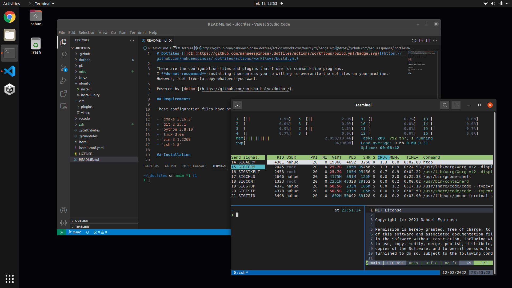

# Dotfiles

[](https://github.com/nahueespinosa/.dotfiles/actions/workflows/build.yml)

These are the configuration files and plugins that I ([@nahueespinosa](https://github.com/nahueespinosa)) use for command-line programs.

Powered by [dotbot](https://github.com/anishathalye/dotbot/).

> [!CAUTION]
> I **do not recommend** installing them unless you're willing to overwrite the dotfiles on your machine. However, feel free to copy whatever you want.



## Requirements

These configuration files have been tested in `Ubuntu 22.04` with:

- `cmake 3.31.2`
- `git 2.34.1`
- `python 3.10.12`
- `tmux 3.2a`
- `vim 8.2`
- `zsh 5.8.1`

## Installation

Change directory to `$HOME` and clone this repository:

```bash
cd $HOME && git clone git@github.com:nahueespinosa/.dotfiles.git
```

Install dotfiles:

```bash
~/.dotfiles/install
```

Make `zsh` your default shell if you haven't already:

```bash
chsh -s $(which zsh)
```